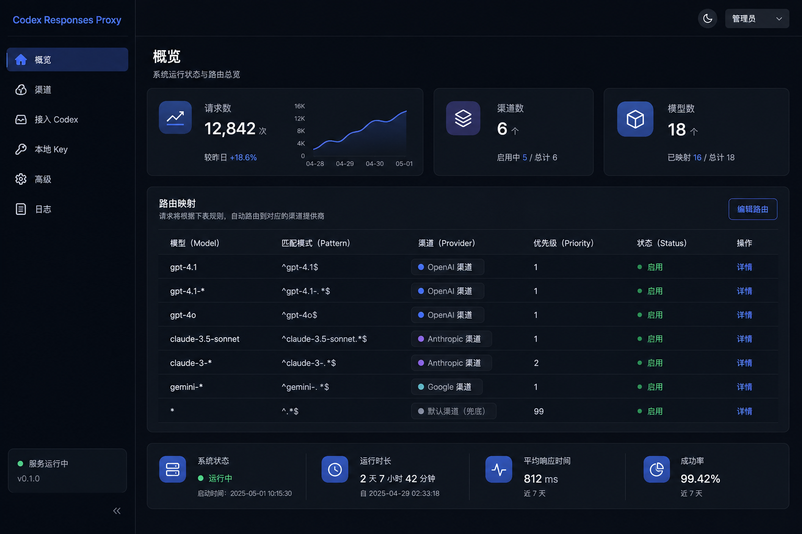
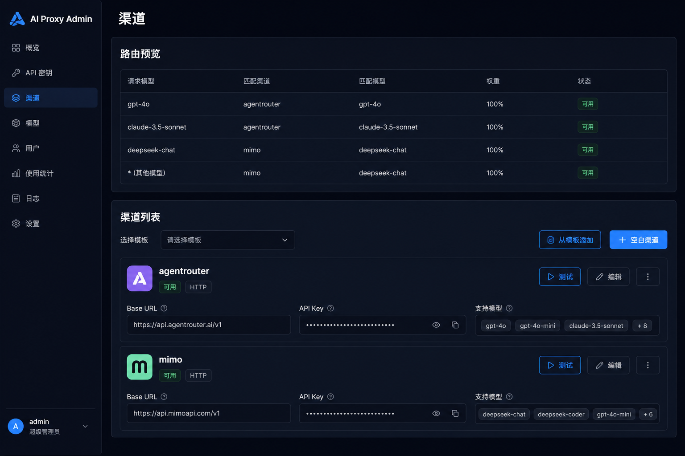
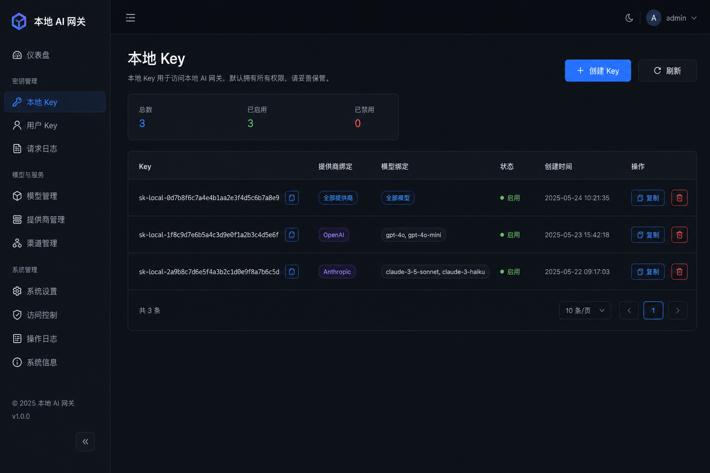
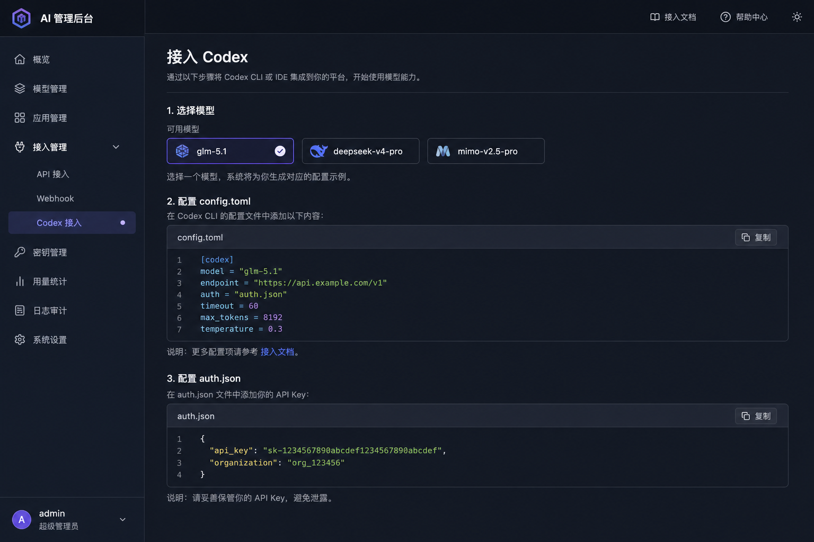

# Codex Responses Proxy

本地代理：让 **Codex CLI**（`wire_api = "responses"`）通过 OpenAI **Chat Completions** 上游使用 agentrouter、MiMo 等模型。

- Responses ⇄ Chat Completions 双向翻译（流式 SSE、工具调用、多轮续接）
- 多渠道按模型名路由
- 内置网页配置后台，保存即热更新（改端口需重启）
- Node.js 18+，零依赖

## 界面截图

启动后访问 `http://127.0.0.1:3001/`（或 `make ui`）。

### 概览 — 运行状态与模型路由

模型名自动映射到对应渠道；可一眼看到当前 Codex 会走哪条上游。



### 渠道 — 统一管理 agentrouter / MiMo

所有上游在同一页配置 Base URL、API Key、模型列表，支持**从模板添加**常用厂商与单渠道测试。



### 本地 Key — 绑定渠道或模型

每个 Key 可限制只能走某个渠道/模型，复制完整 Key 填入 Codex `auth.json`。



### 接入 Codex — 一键复制配置

选择模型后生成 `config.toml` 与 `auth.json` 片段，并标注将路由到哪个渠道。



> 自行更新截图：启动代理后浏览器打开各页面，截屏保存为 `docs/screenshots/` 下同名 PNG 即可（推荐宽度 1200px 左右）。

## 快速开始

```bash
make install   # 可选：全局安装 CLI
make start     # 前台启动（推荐新手，Ctrl+C 停止）
# 或
make start-bg  # 后台启动
make ui        # 打开配置网页
```

也支持 npm / 直接命令：

```bash
npm install -g .
codex-responses-proxy
# 或在项目目录
npm start
```

更多命令：`make` 或 `make help`（status / stop / smoke / test-mimo 等）。

## 安装与打包

**前提：** 本机已安装 [Node.js 18+](https://nodejs.org)（终端执行 `node -v` 能看到版本号即可）。

### 方式一：不安装，直接用（最简单）

在项目目录：

```bash
make start      # 前台启动
make start-bg   # 后台启动
```

不需要 `npm install`，也**不用**全局安装。

### 方式二：安装成系统命令（推荐）

在本机任意目录都能运行 `codex-responses-proxy`：

```bash
cd /path/to/codex-responses-proxy
make install
# 等价于: npm install -g .

codex-responses-proxy          # 启动
codex-responses-proxy --help   # 查看帮助
```

卸载：

```bash
make uninstall
```

### 方式三：打包发给另一台 Mac / Linux

在本机打安装包：

```bash
make pack
# 生成 codex-responses-proxy-1.0.0.tgz
```

把 `.tgz` 文件拷到目标机器，目标机器也需先装 Node.js 18+，然后：

```bash
npm install -g codex-responses-proxy-1.0.0.tgz
codex-responses-proxy
```

### 说明

| 问题 | 答案 |
|------|------|
| 是 `.app` / `.exe` 吗？ | 不是独立二进制，是 **Node CLI**，运行时需要 Node |
| 配置放哪？ | `~/.codex-responses-proxy/config.json` |
| 改配置要重装吗？ | 不用，改配置或网页保存即可 |
| 升级怎么弄？ | 重新 `make install` 或 `npm install -g .` |

首次启动会在 **`~/.codex-responses-proxy/config.json`** 生成默认配置。浏览器打开 `http://127.0.0.1:3001/`，填入各渠道 API Key，点「测试连通性」并保存。

> 若你之前在项目目录有 `config.json`，可复制到上述路径，或通过 `CONFIG_PATH=./config.json codex-responses-proxy` 继续使用旧路径。

## Codex 配置

编辑 `~/.codex/config.toml`：

```toml
model = "glm-5.1"
model_provider = "local_proxy"

[model_providers.local_proxy]
name = "local_proxy"
base_url = "http://127.0.0.1:3001/v1"
wire_api = "responses"
requires_openai_auth = true
```

编辑 `~/.codex/auth.json`（`localKeys` 里**任意一个**即可）：

```json
{ "OPENAI_API_KEY": "sk-local-你的本地key" }
```

可在网页「本地 Key」添加多个 Key，每个 Key 可**绑定渠道或模型**。本地管理页会**完整展示** Key，可直接复制到 Codex 的 `auth.json`。

```json
{
  "localKeys": [
    { "key": "sk-local-xxx", "provider": "mimo", "model": "mimo-v2.5-pro", "label": "笔记本" }
  ]
}
```

换模型：改 `config.toml` 里的 `model`（如 `deepseek-v4-pro`、`mimo-v2.5-pro`），开新 Codex 会话即可，**无需重启代理**。

## 预置渠道与模板

首次启动的默认配置已含 **agentrouter** 与 **MiMo（国内）**。在网页 **渠道** 页还可通过 **「从模板添加」** 快速新增其他厂商——自动填充 Base URL、模型列表与 `thinkingStyle`，你只需填入 API Key 并保存。

| 模板 | Base URL | 示例模型 | thinkingStyle |
|------|----------|----------|---------------|
| AgentRouter | `https://agentrouter.org/v1` | glm-5.1, deepseek-v4-pro | deepseek |
| MiMo（国内） | `https://token-plan-cn.xiaomimimo.com/v1` | mimo-v2.5-pro, mimo-v2.5 | mimo |
| MiMo（国际） | `https://api.xiaomimimo.com/v1` | mimo-v2.5-pro, mimo-v2.5 | mimo |
| DeepSeek | `https://api.deepseek.com/v1` | deepseek-chat, deepseek-reasoner | deepseek |
| 智谱 GLM（Coding） | `https://open.bigmodel.cn/api/coding/paas/v4` | glm-4-flash, glm-4-plus | passthrough |
| MiniMax（国内） | `https://api.minimaxi.com/v1` | MiniMax-Text-01 | passthrough |
| MiniMax（国际） | `https://api.minimax.io/v1` | MiniMax-Text-01 | passthrough |

> MiMo 模型名请使用**小写**（如 `mimo-v2.5-pro`）。AgentRouter 会在上游请求中自动附加 Roo Code 专用请求头（无需在配置里手写 headers）。若模板渠道名已存在，会自动加后缀（如 `mimo-2`）。

## API 端点

| 方法 | 路径 | 说明 |
|------|------|------|
| GET | `/` | 配置网页 |
| GET/POST | `/config` | 读/写配置 |
| POST | `/test` | 测试渠道连通性 |
| GET | `/health` | 健康检查（免鉴权） |
| GET | `/stats` | 运行统计 |
| POST | `/v1/responses` | Codex 主入口 |
| GET | `/v1/models` | 模型列表 |

## 冒烟测试

```bash
make smoke
# 或
npm run smoke
bash scripts/smoke.sh http://127.0.0.1:3001
```

## 环境变量

| 变量 | 默认 | 说明 |
|------|------|------|
| `CONFIG_DIR` | `~/.codex-responses-proxy` | 配置目录 |
| `CONFIG_PATH` | `$CONFIG_DIR/config.json` | 配置文件路径 |
| `LOG_LEVEL` | `info` | 日志级别 |
| `UPSTREAM_TIMEOUT_MS` | `120000` | 上游超时 |
| `STORE_TTL_MS` | `3600000` | 会话 store TTL |
| `STORE_MAX` | `500` | 会话 store 容量 |

## 架构

```
Codex (responses) → 本代理 :3001 → 按 model 路由 → agentrouter / MiMo (chat/completions)
```

## License

MIT
